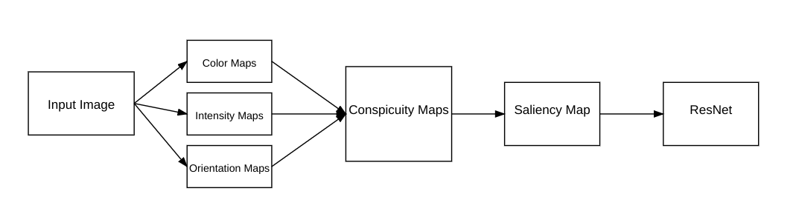

# Computational Modeling of Visual Attention

This project implements a computational model of visual attention based on the work by Itti & Koch (1998). The model simulates human visual attention mechanisms by generating saliency maps and use them for image cropping and classification.

## Model Architecture

## Features

- Implementation of Itti & Koch's visual attention model
- Generation of feature maps (color, intensity, orientation)
- Conspicuity maps computation
- Saliency map generation
- Image cropping based on saliency map
- Image classification using ResNet

